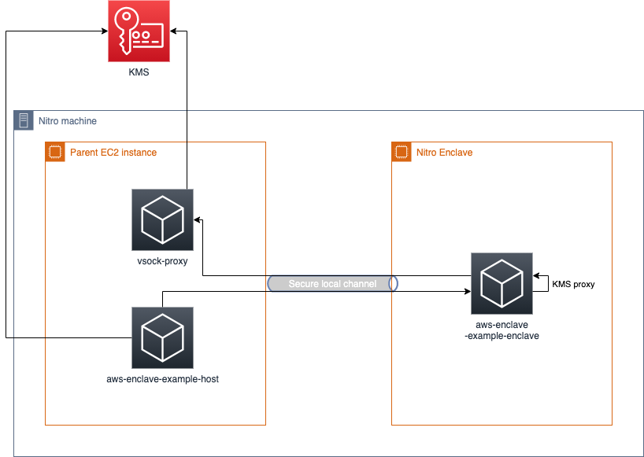

# awsenclave
Easy creation of [AWS enclaves](https://docs.aws.amazon.com/enclaves/latest/user/nitro-enclave.html) in Java.

# How to work with it

The project requires [vsockj](https://app.circleci.com/pipelines/github/Cloud-Architects/vsockj) binary file to work, available only on Linux OS, which means building must be done thought Docker image if not working on Linux.

When developing and running locally, ensure latest jars are in your local mvn repo.

```shell
docker run -w /app -v "$HOME/.m2":/app/.m2 -v "$PWD":/app -ti --rm -u `id -u` \
amazoncorretto:8u275 ./mvnw -Dmaven.repo.local=/app/.m2/repository compile install
```

or
```shell
./mvnw compile install
```

## aws-enclave-setup
The setup right now supports one case - KMS proxy. An overview diagram is shown below:


To run the example Host + enclave setup and verify communication, run the following command (ensure default credentials allow you to create new EC2 instances, create IAM roles and KMS key):
```shell
./mvnw -f aws-enclave-setup/pom.xml compile exec:exec
```
The command should setup necessary resources and run a host application that calls a service in enclave to invoke a DescribeKey call to KMS.

## aws-enclave-example-enclave
To build (preferable run from host or other linux):
```shell
./mvnw -f aws-enclave-example/aws-enclave-example-enclave/pom.xml clean nar:nar-unpack package jib:dockerBuild
```

If not working on Linux:
```shell
docker run -w /app -v "$HOME/.m2":/app/.m2 -v "$PWD":/app -ti --rm -u `id -u` \
amazoncorretto:8u275 ./mvnw -Dmaven.repo.local=/app/.m2/repository -f aws-enclave-example/aws-enclave-example-enclave/pom.xml \
clean nar:nar-unpack package


./mvnw -f aws-enclave-example/aws-enclave-example-enclave/pom.xml compile  jib:dockerBuild
```

To test locally:
```shell
docker run aws-enclave-example-enclave:latest
```
or
```shell
./mvnw -f aws-enclave-example/aws-enclave-example-enclave/pom.xml compile exec:exec
```

To show logs in a running enclave:
```shell
nitro-cli console --enclave-id [enclave-id]
```

## aws-enclave-example-host
To test locally:
```shell
./mvnw -f aws-enclave-example/aws-enclave-example-host/pom.xml compile exec:exec -Denclave.cid=[CID] -Dencrypted.text=[base 64 encrypted text] -Dkey.id=[key id]
```

```shell
docker run -w /app -v "$HOME/.m2":/app/.m2 -v "$PWD":/app -ti --rm -u `id -u` \
amazoncorretto:8u275 ./mvnw -Dmaven.repo.local=/app/.m2/repository -f aws-enclave-example/aws-enclave-example-host/pom.xml \
compile exec:exec -Denclave.cid=23
```

# Deployment

Sample deployment Docker images can be found in `deploy` directory.

## Security considerations

1. The project requires [vsockj](https://app.circleci.com/pipelines/github/Cloud-Architects/vsockj) binary file to work. To be able to review the resulting file, it's recommended to build the binary library, from [vsockj-native](https://github.com/Cloud-Architects/vsockj/tree/main/vsockj-native).
2. The AWS Enclaves use Docker to create an image used to run an enclave. That can be problematic on Windows machines as developers can use Docker Engine to break Windows security.
